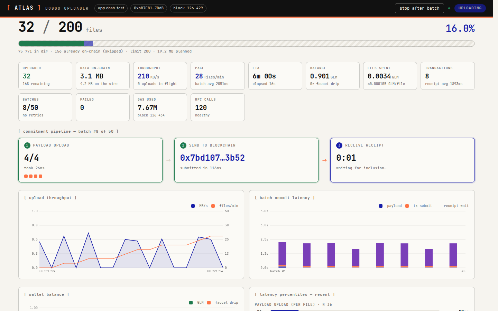

# atlas-doggo-uploader 🐶

Bun-powered batch uploader for the [Atlas](https://scanner.atlas.arkiv-global.net) (experimental Arkiv) data network, with a **real-time dashboard** that shows every stage of the commitment pipeline while ~75k dog pictures march onto the chain.



## What it does

- **Batched uploads** — N images per on-chain transaction: payloads go to the payload provider in parallel, then one `execute()` commits the batch to the EntityRegistry.
- **Live commitment pipeline** — the dashboard tracks each batch through its three stages: ① payload upload → ② send to blockchain → ③ receive receipt, with per-file status dots and stage timings.
- **Real-time stats** — throughput (MB/s, files/min), batch commit latency (stacked payload / tx submit / receipt wait), latency percentiles, wallet balance with faucet-drip markers, gas & fees, RPC health, recent files with scanner links, an event log, and a strip of freshly uploaded doggos served back from the payload provider.
- **Self-sustaining** — auto-tops-up from the public faucet (proof-of-work solved across all cores) when the balance runs low.
- **Duplicate-proof restarts** — a local checkpoint plus on-chain reconciliation (paginated `arkiv_query` by owner+app) means re-runs and fresh servers never re-upload.
- **Lingering dashboard** — after the run finishes the dashboard stays up (default **60 min**, `--linger-min`), shows the final summary and a countdown, and can be extended from the page; then the process exits on its own.

## Quickstart — always-on server

```bash
bun install
ATLAS_ADMIN_TOKEN=change-me bun run serve   # → http://localhost:3000
```

The server stays up permanently: the home page lists every upload session ever run (persisted in a `bun:sqlite` database at `out/sessions.db`), running ones update live, and with the **admin token** you can start, stop and delete sessions right from the page. Viewing needs no token. Each session gets its own dashboard at `/s/<id>` — live while running, reconstructed from SQLite afterwards, forever (delete is explicit and admin-only). Sessions killed by a server restart are marked `interrupted`, keeping everything recorded up to that point.

New sessions either use the server wallet (`ATLAS_PRIVATE_KEY`) or generate a **fresh throwaway wallet** that self-funds from the faucet — fresh wallets let several sessions (different apps) run concurrently. If `ATLAS_ADMIN_TOKEN` is unset a random token is generated and printed at boot.

## One-shot mode

```bash
bun run new-wallet          # writes a throwaway key to .env
bun scripts/upload-dir.mjs --dir /path/to/pngs --app my-dogs --batch 10
```

Runs a single upload with the same live dashboard, keeps it up `--linger-min` (default 60) after finishing, then exits. Stop any time with Ctrl-C (finishes the current batch) or the dashboard's *stop after batch* button.

### CLI options

```
--dir <path>          directory of PNGs (default: the ../Images/Dogs dataset)
--batch <n>           images per transaction, 1-50            (default 10)
--app <name>          "app" attribute used for grouping       (default dogs)
--run <id>            "run" attribute                         (default: app)
--limit <n>           upload at most n files this run
--expires-days <n>    entity TTL in days                      (default 30)
--min-balance <glm>   faucet refill threshold                 (default 0.3)
--no-autofund         never claim from the faucet
--no-reconcile        skip the on-chain duplicate check
--port <n>            dashboard port                          (default $PORT or 3000)
--linger-min <n>      keep the dashboard up n minutes after the run (default 60)
--no-dashboard        headless: no web dashboard
```

### Server API

Mutations require `Authorization: Bearer <admin token>`; reads are public.

| endpoint | method | purpose |
| --- | --- | --- |
| `/` | GET | session list (live) |
| `/s/<id>` | GET | session dashboard — live or historical |
| `/ws` · `/ws?s=<id>` | WS | session list / session state: snapshot on connect, then deltas |
| `/api/sessions` | GET | all sessions as JSON |
| `/api/sessions` | POST 🔒 | start a session `{dir, app, batch, limit, expiresDays, walletMode: "fresh"\|"env"}` |
| `/api/sessions/<id>` | GET | full state snapshot |
| `/api/sessions/<id>/stop` | POST 🔒 | finish the current batch, then stop |
| `/api/sessions/<id>` | DELETE 🔒 | delete a non-running session and all its statistics |
| `/healthz` | GET | container healthcheck |

(One-shot mode keeps its `/api/state`, `/api/stop` and `/api/linger?min=n`.)

## Docker

Published to GHCR on every push/tag. The container runs the always-on server; mount `/app/out` to keep the SQLite history across restarts:

```bash
docker run -p 3000:3000 \
  -e ATLAS_ADMIN_TOKEN=change-me \
  -v /path/to/pngs:/data:ro \
  -v "$PWD/out:/app/out" \
  ghcr.io/atlas-chain/atlas-doggo-uploader:latest
```

For a one-shot containerized job, `scripts/upload-docker.sh <alias> <dir>` builds the image, generates a fresh wallet and starts an isolated named upload with its own checkpoint and dashboard port (`PORT=3001 scripts/upload-docker.sh cats ./cats`).

## Repo layout

```
src/uploader/    engine (batching, checkpoint, reconcile, faucet), event-bus
                 instrumentation (payload fetch + RPC transport observers), stats
src/server/      always-on service: session manager, admin API, bun:sqlite persistence
src/dashboard/   one-shot Bun.serve server and the shared dashboard UI (home + session)
src/lib/         Atlas endpoints/clients, faucet PoW client, raw read helpers
scripts/         server (main service), upload-dir (one-shot CLI), viewer, bench, …
tests/           bun test — offline by default, ATLAS_E2E=1 for the live round-trip
```

Other apps that share the libs: `bun run viewer` (on-chain image gallery), `bun run bench` (multi-wallet load test), `bun run hello` (round-trip smoke).

## Development

```bash
bun test tests/            # offline tests
ATLAS_E2E=1 bun test tests/ # + live upload/download round-trip
```

Testnet only: keys are throwaways, GLM comes from the public faucet, and everything uploaded expires with its TTL.
